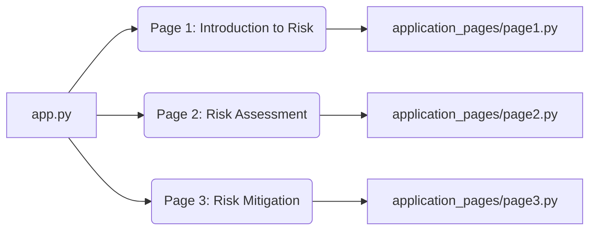

id: 6871750b0b5b6e3bdb04be3a_documentation
summary: Module 6 Lab 1 Documentation
feedback link: https://docs.google.com/forms/d/e/1FAIpQLSfWkOK-in_bMMoHSZfcIvAeO58PAH9wrDqcxnJABHaxiDqhSA/viewform?usp=sf_link
environments: Web
status: Published
# Operational Risk Management with Streamlit: A Codelab

This codelab guides you through a Streamlit application designed to explore key concepts in operational risk management. You will learn about risk appetite, risk assessment, and mitigation strategies using interactive visualizations and simulated data. This application provides a practical understanding of how these concepts influence organizational risk profiles and capital management, crucial for developers and professionals in finance, risk management, and related fields.

## Setting Up Your Environment
Duration: 00:05

Before diving into the application, ensure you have Python installed along with the necessary libraries.

1.  **Install Python:** If you haven't already, download and install Python from the official Python website. It is recommended to use Python 3.7 or higher.
2.  **Install Streamlit:** Open your terminal or command prompt and run the following command to install Streamlit:

```console
pip install streamlit pandas plotly
```

## Understanding the Application Structure
Duration: 00:10

The application is structured as follows:

*   `app.py`: This is the main entry point of the Streamlit application. It sets up the basic layout, including the title, sidebar, and navigation.
*   `application_pages/`: This directory contains individual Python files for each page of the application. Each file defines a function that renders the content for that page.
    *   `page1.py`: Introduces the concept of risk and different risk types.
    *   `page2.py`: Demonstrates a simple risk assessment process.
    *   `page3.py`: Explores various risk mitigation strategies.

Here's a visual representation of the application architecture:



## Running the Application
Duration: 00:02

1.  Save the provided code into the respective files (`app.py` and the files in `application_pages/`).
2.  Open your terminal or command prompt, navigate to the directory containing `app.py`, and run the following command:

```console
streamlit run app.py
```

This will launch the Streamlit application in your web browser.

## Exploring Page 1: Introduction to Risk
Duration: 00:10

This page provides a basic introduction to the concept of risk, focusing on three common types: operational, financial, and strategic.

1.  **Navigation:** In the sidebar, select "Page 1" from the "Navigation" dropdown.
2.  **Content:** The page displays a table describing each risk type and a bar chart visualizing the same information.

```python
import streamlit as st
import pandas as pd
import plotly.express as px

def run_page1():
    st.header("Page 1: Introduction to Risk")
    st.write("This page provides an introduction to the concept of risk and its importance in operational management.")
    df = pd.DataFrame({'Risk Type': ['Operational', 'Financial', 'Strategic'], 'Description': ['Risks from internal processes', 'Risks from market fluctuations', 'Risks from business strategy']})
    st.dataframe(df)
    fig = px.bar(df, x='Risk Type', y='Description')
    st.plotly_chart(fig)
```

This page highlights the importance of understanding different risk categories as a foundation for effective risk management. The `pandas` library is used to create a DataFrame to hold the risk type and description, which is then displayed using `st.dataframe`.  The `plotly.express` library is used to create interactive bar chart.

## Exploring Page 2: Risk Assessment
Duration: 00:15

This page demonstrates a simplified risk assessment process, quantifying risk based on likelihood and impact.

1.  **Navigation:** Select "Page 2" from the "Navigation" dropdown in the sidebar.
2.  **Content:** The page displays a table showing different risks along with their likelihood, impact, and calculated risk score. A scatter plot visualizes the relationship between likelihood and impact, with the size of each point representing the risk score.

```python
import streamlit as st
import pandas as pd
import plotly.express as px

def run_page2():
    st.header("Page 2: Risk Assessment")
    st.write("This page demonstrates a simple risk assessment process.")
    df = pd.DataFrame({'Risk': ['Cybersecurity breach', 'Supply chain disruption', 'Regulatory non-compliance'], 'Likelihood': [0.6, 0.3, 0.2], 'Impact': [10, 8, 7]})
    df['Risk Score'] = df['Likelihood'] * df['Impact']
    st.dataframe(df)
    fig = px.scatter(df, x='Likelihood', y='Impact', text='Risk', size='Risk Score')
    fig.update_traces(textposition='top center')
    st.plotly_chart(fig)
```

The risk score is calculated by multiplying the likelihood and impact. This score helps prioritize risks. The scatter plot generated using `plotly.express` allows for easy identification of high-risk areas. The size of the bubble is proportional to the risk score.

## Exploring Page 3: Risk Mitigation
Duration: 00:10

This page introduces common risk mitigation strategies used to reduce the impact or likelihood of identified risks.

1.  **Navigation:** Select "Page 3" from the "Navigation" dropdown in the sidebar.
2.  **Content:** The page presents a table listing various mitigation strategies and their descriptions. A pie chart visualizes the distribution of these strategies.

```python
import streamlit as st
import pandas as pd
import plotly.express as px

def run_page3():
    st.header("Page 3: Risk Mitigation")
    st.write("This page explores various risk mitigation strategies.")
    df = pd.DataFrame({'Mitigation Strategy': ['Insurance', 'Redundancy', 'Process improvement'], 'Description': ['Transferring risk to an insurer', 'Creating backups to minimize disruption', 'Improving processes to reduce risk']})
    st.dataframe(df)
    fig = px.pie(df, values='Description', names='Mitigation Strategy')
    st.plotly_chart(fig)
```

This page emphasizes the importance of proactive risk management through strategic mitigation. A pie chart provides a visual representation of different mitigation strategies.

## Expanding the Application
Duration: 00:30

This Streamlit application provides a basic framework for understanding operational risk management.  Here are some potential expansions:

*   **Interactive Risk Assessment:** Implement interactive widgets to allow users to adjust likelihood and impact values and see the resulting changes in the risk score and visualizations.
*   **Risk Appetite Integration:** Introduce the concept of risk appetite and allow users to define tolerance levels. Visualize how different risk profiles align with or exceed the defined risk appetite.
*   **Scenario Analysis:** Create scenarios with varying risk parameters and simulate their impact on organizational performance and capital requirements.
*   **Data Input:** Allow users to upload their own data for risk assessment, making the application more versatile and relevant to real-world situations.
*   **Database Integration:** Integrate with a database to store and retrieve risk data, facilitating long-term monitoring and analysis.

<aside class="positive">
This application demonstrates the power of Streamlit for building interactive data applications. By combining Streamlit with libraries like Pandas and Plotly, you can create powerful tools for visualizing and analyzing complex data.
</aside>

## Conclusion
Duration: 00:03

This codelab provided a hands-on introduction to operational risk management using a Streamlit application. You explored key concepts such as risk assessment and mitigation strategies through interactive visualizations. By extending this application, you can create more sophisticated tools for managing risk in various organizational settings.
